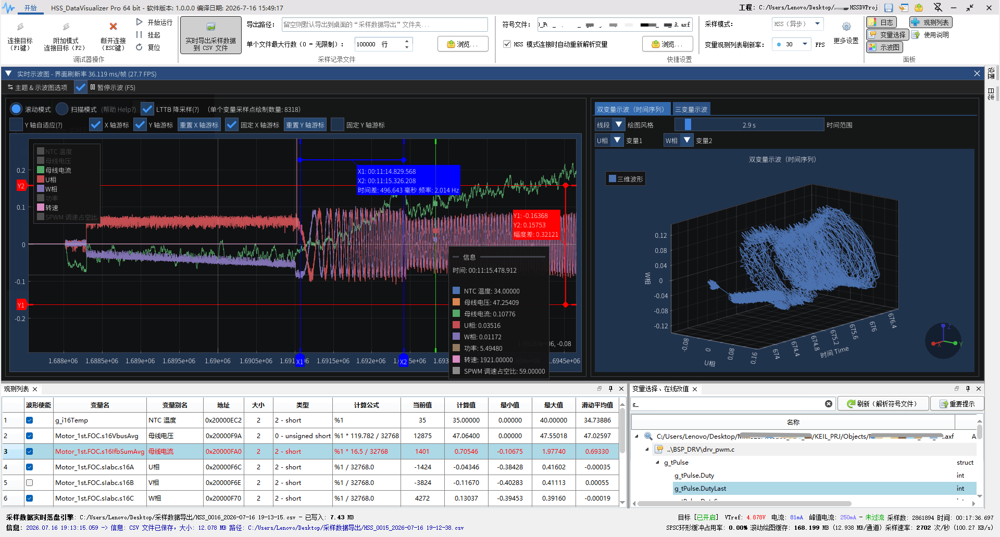
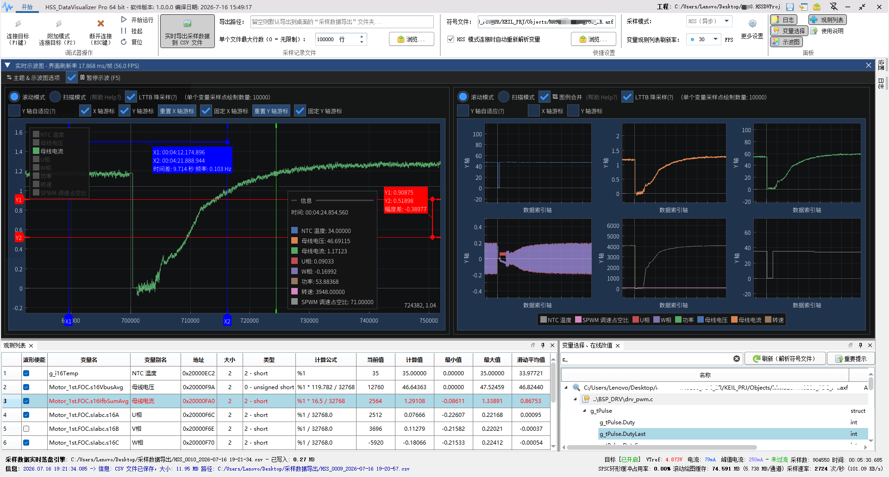

<h1>🍺 HSS_DataVisualizer &amp; UNI_DataVisualizer</h1>

<b>基于 SWD / JTAG 接口的 MCU 全局变量高速采样可视化实时示波工具</b>

<i>High-Speed-Sampling (HSS) · Real-Time-Transfer (RTT) · 2D / 3D 实时示波</i>

  
  
  

  
  

<table>
<tr>
<td width="50%" align="center">

**HSS_DataVisualizer Pro**

</td>
<td width="50%" align="center">

**UNI_DataVisualizer Pro**

</td>
</tr>
</table>

> [!NOTE]
> 本仓库用于 HSS_DataVisualizer & UNI_DataVisualizer 的发布，当前版本：**v1.0.1.0**。下载请跳转程序发布页面 [GitHub](https://github.com/DigitalAllianceStudio/HSS_DataVisualizer/releases/latest) 或 [Gitee](https://gitee.com/tomystark/DataVisualizer-Release/releases/latest)。

> [!TIP]
> :question: 使用 Texas Instruments 的芯片（例如 `TMS320F28035` 以及国产 1:1 替代芯片，例如湖南进芯的 DSP `ADP32F035`，以及 `MSP430` 等...）和 `XDS100v3`、`XDS110`、`XDS560v2 Plus` 等调试器？
>
> :bulb: 请使用 Texas Instruments 德州仪器芯片专用的非侵入式数据可视化实时示波工具：`DSS_DataVisualizer`
> - GitHub 仓库地址：[https://github.com/DigitalAllianceStudio/DSS_DataVisualizer](https://github.com/DigitalAllianceStudio/DSS_DataVisualizer)
> - Gitee&nbsp;&nbsp;仓库地址：[https://gitee.com/tomystark/DSS_DataVisualizer-Release](https://gitee.com/tomystark/DSS_DataVisualizer-Release)

---

## 目录

- [目录](#目录)
- [📖 简介](#-简介)
- [🚩 特性对比](#-特性对比)
  - [1. 采样模式](#1-采样模式)
  - [2. RTT 模式丢包特殊处理](#2-rtt-模式丢包特殊处理)
  - [3. 波形 Y 轴缩放、偏移](#3-波形-y-轴缩放偏移)
- [⚠️ 注意事项](#️-注意事项)
- [🖼️ 软件截图](#️-软件截图)
  - [专业版](#专业版)
  - [标准版](#标准版)

---

## 📖 简介

本工具套件分为 **4 个软件**：

| 软件 | 说明 |
| --- | --- |
| **HSS_DataVisualizer** `Std` / `Pro` | SEGGER **J-Link** / **J-Trace** 专用数据可视化工具 |
| **UNI_DataVisualizer** `Std` / `Pro` | 通用数据可视化工具，支持 **DAP-Link** / **ST-Link V2**（固件版本 `v2.26` 及以上）/ **ST-Link V3**（固件版本 `v3.2` 及以上）/ **J-Link** / **Black Magic** / **FTDI**（Olimex ARM-USB 系列调试器）/ **WCH-Link** / **CH347usbjtag** / **Glasgow Interface Explorer** 等调试器 |

4 个软件均支持 *High-Speed-Sampling (HSS)* 和 *Real-Time-Transfer (RTT)* 模式，通过 SWD / JTAG 接口，对 MCU RAM 中的全局变量进行**非侵入式的后台高速访问**，并实时将波形和数据可视化到用户界面。其原理类似于 J-Scope、STM Studio、STM32CubeMonitor，下文提供了它们的详细对比。

---

## 🚩 特性对比

| 特性 | HSS_DataVisualizer Std | HSS_DataVisualizer Pro | UNI_DataVisualizer Std | UNI_DataVisualizer Pro | J-Scope |
| --- | :---: | :---: | :---: | :---: | :---: |
| 调试器支持 | J-Link / J-Trace 专版优化① | J-Link / J-Trace 专版优化① | 多调试器广泛支持② | 多调试器广泛支持② | J-Link / J-Trace |
| 采样模式1 | HSS / RTT | HSS / RTT | HSS / RTT | HSS / RTT | HSS / RTT / **RTT-Plus** |
| CSV 采样数据导出 - 实时落盘 | ✅ | ✅ | ✅ | ✅ | ❌ （必须停止采样才能导出） |
| CSV 采样数据导出 - 自定义导出路径 | ❌ （仅默认导出到桌面 “采样数据导出” 文件夹） | ✅ | ❌ （仅默认导出到桌面 “采样数据导出” 文件夹） | ✅ | ✅ |
| CSV 采样数据导出 - 自定义文件分割、编号 | ❌ （单次启用仅支持单文件导出） | ✅ （可自定义每多少行采样数据自动分割一次文件） | ❌ （单次启用仅支持单文件导出） | ✅ （可自定义每多少行采样数据自动分割一次文件） | ❌ |
| HSS 模式连接时自动重新解析变量 | ❌ | ✅ | ❌ | ✅ | ❌ （半自动，若符号文件变化会弹窗询问） |
| RTT 模式丢包特殊处理2 | ✅ | ✅ | ✅ | ✅ | ❌ （丢包时数据出现极值，波形错乱充满示波区域，有迷惑性） |
| 变量快捷搜索筛选 | ✅ | ✅ | ✅ | ✅ | ✅ （需要独立弹窗打开，较为不便） |
| ELF/AXF/OUT 符号文件解析速度 | 超快 | 超快 | 超快 | 超快 | 慢 |
| 符号文件编程语言支持 | C / C++ / Rust | C / C++ / Rust | C / C++ / Rust | C / C++ / Rust | C / C++ / Rust |
| 符号文件工具链支持 | ARMCC / ARMCLANG / IAR / GCC / clang LLVM rustc | ARMCC / ARMCLANG / IAR / GCC / clang LLVM rustc | ARMCC / ARMCLANG / IAR / GCC / clang LLVM rustc | ARMCC / ARMCLANG / IAR / GCC / clang LLVM rustc | ARMCC / ARMCLANG / IAR / GCC / clang LLVM rustc |
| 变量在线修改 | ✅ | ✅ | ✅ | ✅ | ❌ |
| 波形触发功能 | ❌ | ❌ | ❌ | ❌ | ✅ |
| 波形数据回放 | ❌ | ❌ | ❌ | ❌ | ✅ |
| 波形颜色自定义 | ❌ | ❌ | ❌ | ❌ | ✅ |
| 波形 Y 轴缩放、偏移3 | ❌ | ❌ | ❌ | ❌ | ✅ |
| 独立的采样使能 | ✅ | ✅ | ✅ | ✅ | ❌ |
| 独立的波形使能 | ✅ | ✅ | ✅ | ✅ | ✅ |
| 变量别名 | ✅ | ✅ | ✅ | ✅ | ❌ |
| 变量公式计算（支持 Javascript Math 表达式） | ✅ | ✅ | ✅ | ✅ | ❌ |
| 最小值、最大值、滑动平均值 | ✅ | ✅ | ✅ | ✅ | ✅ |
| 2D 示波图 - 单图模式 | ✅ | ✅ | ✅ | ✅ | ✅ |
| 2D 示波图 - 多图模式 | ✅ | ✅ | ✅ | ✅ | ❌ |
| 2D 示波图 - 单 / 多图模式 - X/Y 轴游标测量 | ✅ | ✅ | ✅ | ✅ | ✅ （仅支持 X 轴游标测量） |
| 2D 示波图 - 单 / 多图模式 - 滚动模式 | ✅ | ✅ | ✅ | ✅ | ✅ |
| 2D 示波图 - 单 / 多图模式 - 扫描模式 | ✅ | ✅ | ✅ | ✅ | ❌ |
| 3D 示波图 | ✅ | ✅ | ✅ | ✅ | ❌ |
| 3D 图形 | ✅ | ✅ | ✅ | ✅ | ❌ |
| 示波器主题切换 | ✅ | ✅ | ✅ | ✅ | ❌ |
| Ribbon Style | ❌ | ✅ | ❌ | ✅ | ❌ |
| 高级窗体停靠系统 | ❌ | ✅ | ❌ | ✅ | ❌ |

> ① J-Link / J-Trace 专版优化：`J-Trace Cortex-M PRO V2` RTT 模式最高采样率实测可达 `2.1 MB/s`（单帧 10 个变量无时间戳合计 29 字节，每秒采样 `74K` 次）。
>
> ② 多调试器广泛支持：DAP-Link / ST-Link V2/V3 / J-Link / Black Magic / FTDI（Olimex ARM-USB 系列调试器）/ WCH-Link / CH347usbjtag / Glasgow Interface Explorer 等。

### 1. 采样模式

> [!NOTE]
> RTT 模式下，目标 MCU 端 RTT 库的移植和使用请参考该工程：[https://github.com/SummerFalls/F031K6T6_TestProj](https://github.com/SummerFalls/F031K6T6_TestProj)
>
> 其它参考资料：
> 1. [RTT: Instrumenting an application to use it with J-Scope](https://kb.segger.com/UM08028_J-Scope#RTT:_Instrumenting_an_application_to_use_it_with_J-Scope)
> 2. [SEGGER's Real Time Transfer (RTT)](https://kb.segger.com/RTT)

### 2. RTT 模式丢包特殊处理

RTT 模式下 MCU 高频发包时，对于低端 J-Link 的丢包情况进行了特殊处理（**这个处理 J-Scope 没有做**，见下图），比如 J-Link OB、J-Link V9 等低端 J-Link，让 MCU 直接在主循环或者高频中断中写 RTT 缓冲，会有很多封包出错（J-Link OB 测试了下 RTT 极限速度好像就是在 134 KB/s，不过这个速度已经比较容易产生错误数据）。所谓特殊处理，其实指的就是如果发生丢字节的情况，为了防止数据错乱、失去对齐导致采样值出现极大值、极小值的问题，目前的策略是将丢了字节的那一包整包丢弃，如下图所示，被丢弃的数据点会被填充为 **0**。特殊处理前后对比如下：

<table>
<tr>
<td colspan="2" align="center"><b>J-Scope RTT 采样发生丢包</b> 可以看到丢包时数据出现极值，波形错乱充满示波区域，有迷惑性</td>
</tr>
<tr>
<td colspan="2" align="center">

</td>
</tr>
<tr>
<td width="50%" align="center"><b>本工具系列套件 - RTT 丢包 · 特殊处理前</b></td>
<td width="50%" align="center"><b>本工具系列套件 - RTT 丢包 · 特殊处理后</b></td>
</tr>
<tr>
<td width="50%" align="center">

</td>
<td width="50%" align="center">

</td>
</tr>
</table>

### 3. 波形 Y 轴缩放、偏移

未来计划新增 `2D 示波图 - 单图模式（增益偏移模式）`，当前对于多个波形可用 `2D 示波图 - 多图模式` 观测波形（多个波形图拥有各自独立的 Y 轴坐标系）。

---

## ⚠️ 注意事项

> [!IMPORTANT]
> :warning: 若运行报错（如 `缺少动态链接库`），请安装 :package: `vcredist_x64.exe` 和 :package: `vc_redist.x64.exe` 运行库。

<b>HSS_DataVisualizer 注意事项</b>

 

- 本工具仅支持 SEGGER **J-Link** / **J-Trace** 调试器（建议使用 `SEGGER` 官方驱动以获得更好的性能），使用其他调试器请使用通用数据可视化工具 `UNI_DataVisualizer`。
- 较老版本的 J-Link 驱动安装路径问题：J-Link 驱动安装时的路径请不要带版本号，否则可能会导致程序无法正常工作，详细说明如下图所示。

  

<b>UNI_DataVisualizer 注意事项</b>

 

- **ST-Link V2/V3**：请确保已安装最新版的 ST-Link [固件 STSW-LINK007](https://www.st.com/en/development-tools/stsw-link007.html) 和 [驱动 STSW-LINK009](https://www.st.com/en/development-tools/stsw-link009.html)。
- **J-Link**：需要通过 J-Link 官方软件包内的 `JLinkConfig.exe` 将 J-Link 配置为 WinUSB 驱动（某些 J-Link 在配置对话框中可能无法选择 WinUSB 选项，在这种情况下，请使用 [Zadig](https://zadig.akeo.ie/) 安装通用的 WinUSB 驱动程序）。**若使用专用数据可视化工具 `HSS_DataVisualizer`，则建议使用 `SEGGER` 官方驱动以获得更好的性能，在通用数据可视化工具 `UNI_DataVisualizer` 中使用 J-Link 时才需要配置为 WinUSB 驱动。**

  > :warning: 注意：不建议在 `UNI_DataVisualizer` 中使用 J-Link，因为那样无法发挥 J-Link 的最强性能。实测 J-Link Ultra+ 在 `UNI_DataVisualizer` 中的采样速率只有 **500 次/秒**，而在 `HSS_DataVisualizer` 中则可高达 **33000 次/秒**。

  

- **Black Magic**：请参阅 [Black Magic 调试器官网](https://black-magic.org/index.html)、[Black Magic 调试器仓库](https://github.com/blackmagic-debug/blackmagic) 了解更多信息。
- **FTDI**：FTDI 指的是使用 FTDI 公司的 USB-JTAG 桥接器构建的一系列调试器，`UNI_DataVisualizer` 支持使用了以下芯片的 FTDI 调试器（不支持 FTDI 官方的 VCP 或 D2xx 驱动，请使用 [Zadig](https://zadig.akeo.ie/) 安装通用的 WinUSB 驱动程序）：`FT232H`、`FT2232C`、`FT2232D`、`FT2232H`、`FT4232H`，例如 Olimex ARM-USB 系列调试器：`OLIMEX-ARM-USB-TINY-H`、`OLIMEX-ARM-USB-TINY`、`OLIMEX-ARM-USB-OCD-H`、`OLIMEX-ARM-USB-OCD`。
- **WCH-Link**：请参阅 [WCH-Link 调试器官网](https://www.wch.cn/products/WCH-Link.html)、[WCH-Link 调试器仓库](https://github.com/ch32-rs/wlink)、[WCH-Link 调试器仓库参考文献](https://github.com/ch32-rs/wlink/blob/main/docs/references.md) 了解更多信息。
- **CH347usbjtag**：请参阅 [CH347usbjtag 调试器官网](https://www.wch.cn/products/CH347.html)、[CH347usbjtag 调试器仓库](https://github.com/WCHSoftGroup/ch347) 了解更多信息。
- **Glasgow Interface Explorer**：使用方法请参阅 [probe-setup 的 Glasgow Interface Explorer 章节](https://probe.rs/docs/getting-started/probe-setup/)，其它请参阅 [Glasgow Interface Explorer 调试器官网](https://glasgow-embedded.org/)、[Glasgow Interface Explorer 调试器仓库](https://github.com/GlasgowEmbedded/glasgow/) 了解更多信息。

---

## 🖼️ 软件截图

### 专业版

### 标准版

---

:star: Copyright © 2023 - 2026 **Digital Alliance Studio**. All rights reserved. :star:

如果这个项目对你有帮助，欢迎点亮一颗 Star ⭐

