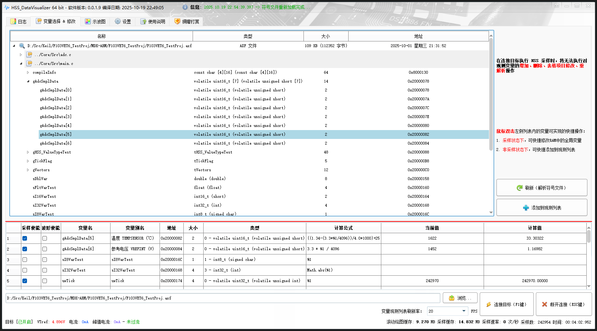

# :beers: HSS Data Visualizer

## :book: 简介

本仓库用于 HSS Data Visualizer 的发布，下载请跳转 [发布页面 (当前版本: v0.0.1.6)](https://github.com/DigitalAllianceStudio/HSS_DataVisualizer/releases)

本程序通过 SEGGER High-Speed-Sampling (HSS) 方式，对 MCU 上的 RAM、Flash、寄存器进行非侵入式的后台高速访问，并实时可视化显示到用户界面，其原理类似于 J-Scope、STM Studio、STM32CubeMonitor。

在 J-Scope 的基础上，除了高速采样，额外增加了变量修改功能。

### 采样数据导出 CSV

## :warning: 注意事项

- J-Link 驱动安装时的路径请不要带版本号，否则可能会导致程序无法正常工作
- 若运行报错（如`缺少动态链接库`），请安装 `vcredist_x64.exe` 和 `vc_redist.x64.exe` 运行库。

----------

:star: Copyright © 2023 - 2025 Digital Alliance Studio. All rights reserved.
