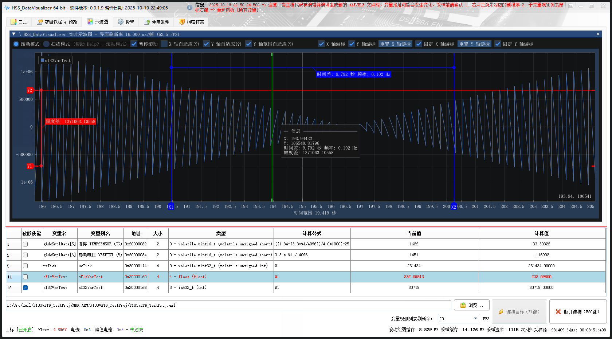

<table style = "width: 100%;">
<tr>
<td colspan="2" style = "text-align: center; font-size: 3em; font-weight: bold;">

:beers: HSS_DataVisualizer 

</td>
</tr>
<tr>
<td style = "width: 30%;">

## :book: 简介

本仓库用于 HSS_DataVisualizer 的发布，下载请跳转 [发布页面 (当前版本: v0.0.2.1)](https://github.com/DigitalAllianceStudio/HSS_DataVisualizer/releases)

本程序通过 SEGGER High-Speed-Sampling (HSS) 方式，对 MCU RAM 中的全局变量进行非侵入式的后台高速访问，并实时将波形和数据可视化到用户界面，其原理类似于 J-Scope、STM Studio、STM32CubeMonitor。

</td>
<td style = "width: 70%;">

### 本工具是JScope的平替，相比JScope，本工具支持和新增的功能

1. 变量别名设定
2. 变量`公式计算`实时显示（支持 `Javascript Math` 表达式、移位等操作）
3. 更便利的变量地址重新解析功能（支持 AXF/ELF/OUT 等格式）
4. 新增观测的同时`修改变量的功能`
5. 更棒的变量增删改查、采样使能、波形使能体验
6. 更便利和高清的示波图操作（模式有`扫描模式`、`滚动模式`：支持滚动、缩放、平移、游标测量等操作）
7. 支持`采样数据导出 CSV`

</td>
</tr>
<tr>
<td colspan="2" style = "text-align: center; font-size: 2em; font-weight: bold;">

:warning: 注意事项

</td>
</tr>
<tr>
<td colspan="2" style = "text-align: center; font-size: 2em; font-weight: bold;">

- J-Link 驱动安装时的路径请不要带版本号，否则可能会导致程序无法正常工作
- :warning: 若运行报错（如`缺少动态链接库`），请安装 :package: `vcredist_x64.exe` 和 :package: `vc_redist.x64.exe` 运行库。

</td>
</tr>
</table>

### 采样数据导出 CSV

----------

:star: Copyright © 2023 - 2025 Digital Alliance Studio. All rights reserved.
