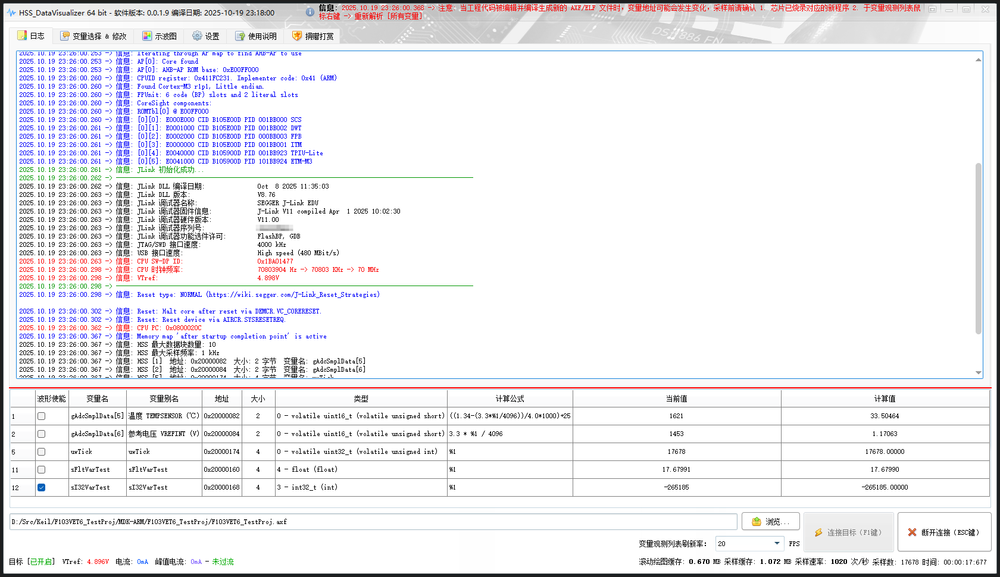

<table style = "width: 100%;">
<tr>
<td colspan="2">

:beers: HSS_DataVisualizer & UNI_DataVisualizer 

> [!NOTE]
> 本仓库用于 HSS_DataVisualizer & UNI_DataVisualizer 的发布，下载请跳转 [发布页面 (当前版本: v0.0.3.2)](https://github.com/DigitalAllianceStudio/HSS_DataVisualizer/releases/latest)

> :question: 使用 Texas Instruments 的芯片（例如 `TMS320F28035` 以及国产1:1替代芯片例如湖南进芯的DSP，例如 `ADP32F035`，以及 `MSP430` 等...）和 `XDS100v3`、`XDS110`、`XDS560v2 Plus` 等调试器？
> :link: 请使用适用于 Texas Instruments 德州仪器芯片的非侵入式数据可视化实时示波工具：`DSS_DataVisualizer`，仓库地址：[https://github.com/DigitalAllianceStudio/DSS_DataVisualizer](https://github.com/DigitalAllianceStudio/DSS_DataVisualizer)

</td>
</tr>
<tr>
<td style = "width: 30%;">

## :book: 简介

`HSS_DataVisualizer` 通过 SEGGER High-Speed-Sampling (HSS) 方式，`UNI_DataVisualizer` 通过 SWD/JTAG 直读方式，对 MCU RAM 中的全局变量进行非侵入式的后台高速访问，并实时将波形和数据可视化到用户界面，其原理类似于 J-Scope、STM Studio、STM32CubeMonitor。

</td>
<td style = "width: 70%;">

> [!TIP]
> 本工具是 J-Scope 的平替，相比 J-Scope，本工具支持和新增的功能：

1. 变量别名设定
2. 变量`公式计算`实时显示（支持 `Javascript Math` 表达式、移位等操作）
3. 更便利的变量地址重新解析功能（支持 AXF/ELF/OUT 等格式）
4. 新增观测的同时`修改变量的功能`
5. 更棒的变量增删改查、采样使能、波形使能体验
6. 更便利和高清的示波图操作（模式有`扫描模式`、`滚动模式`：支持滚动、缩放、平移、游标测量等操作）
7. 支持 2D 示波图、3D 示波图
8. 支持`采样数据导出 CSV`
9. 以附加模式连接（不复位芯片）

</td>
</tr>
<tr>
<td colspan="2">

> [!IMPORTANT]
> **注意事项：** :warning: 若运行报错（如`缺少动态链接库`），请安装 :package: `vcredist_x64.exe` 和 :package: `vc_redist.x64.exe` 运行库。

> [!NOTE]
> 本工具套件分为 2 个部分：
> 1. HSS_DataVisualizer - SEGGER **J-Link** / **J-Trace** 专用数据可视化工具
> 2. UNI_DataVisualizer - 通用数据可视化工具（支持 **DAP-Link** / **ST-Link V2** （固件版本 `v2.26` 及以上） / **ST-Link V3** （固件版本 `v3.2` 及以上） / **J-Link** / **Black Magic** / **FTDI** / **WCH-Link** / **CH347usbjtag** / **Glasgow Interface Explorer** 等调试器...）

> [!IMPORTANT]
> **HSS_DataVisualizer 注意事项：**

- 本工具仅支持 SEGGER **J-Link** / **J-Trace** 调试器（建议使用 `SEGGER` 官方驱动以获得更好的性能），使用其他调试器请使用通用数据可视化工具 `UNI_DataVisualizer`
- 较老版本的 J-Link 驱动安装路径问题
  > 
  > J-Link 驱动安装时的路径请不要带版本号，否则可能会导致程序无法正常工作，详细说明如上图所示。

> [!IMPORTANT]
> **UNI_DataVisualizer 注意事项：**

- **ST-Link V2/V3**：请确保已安装最新版的 ST-Link [固件 STSW-LINK007](https://www.st.com/en/development-tools/stsw-link007.html) 和 [驱动 STSW-LINK009](https://www.st.com/en/development-tools/stsw-link009.html)
- **J-Link**：需要通过 J-Link 官方软件包内的 `JLinkConfig.exe` 将 J-Link 配置为 WinUSB 驱动（某些 J-Link 在配置对话框中可能无法选择 WinUSB 选项，在这种情况下，请使用 [Zadig](https://zadig.akeo.ie/) 安装通用的 WinUSB 驱动程序），**若使用专用数据可视化工具 `HSS_DataVisualizer`，则建议使用 `SEGGER` 官方驱动以获得更好的性能，在通用数据可视化工具 `UNI_DataVisualizer` 中使用 J-Link 时才需要配置为 WinUSB 驱动** :warning: 注意：不建议在 `UNI_DataVisualizer` 中使用 J-Link，因为那样无法发挥 J-Link 的最强性能，实测 J-Link Ultra+ 在 `UNI_DataVisualizer` 中的采样速率只有 **500 次/秒**，而在 `HSS_DataVisualizer` 中则可高达 **33000 次/秒** 
- **Black Magic**：请参阅 [Black Magic 调试器官网](https://black-magic.org/index.html)、[Black Magic 调试器仓库](https://github.com/blackmagic-debug/blackmagic) 了解更多信息
- **FTDI**：FTDI 指的是使用 FTDI 公司的 USB-JTAG 桥接器构建的一系列调试器，`UNI_DataVisualizer` 支持使用了以下芯片的 FTDI 调试器（不支持 FTDI 官方的 VCP 或 D2xx 驱动，请使用 [Zadig](https://zadig.akeo.ie/) 安装通用的 WinUSB 驱动程序）：`FT232H`、`FT2232C`、`FT2232D`、`FT2232H`、`FT4232H`，例如 Olimex ARM-USB 系列调试器：`OLIMEX-ARM-USB-TINY-H`、`OLIMEX-ARM-USB-TINY`、`OLIMEX-ARM-USB-OCD-H`、`OLIMEX-ARM-USB-OCD`
- **WCH-Link**：请参阅 [WCH-Link 调试器官网](https://www.wch.cn/products/WCH-Link.html)、[WCH-Link 调试器仓库](https://github.com/ch32-rs/wlink)、[WCH-Link 调试器仓库参考文献](https://github.com/ch32-rs/wlink/blob/main/docs/references.md) 了解更多信息
- **CH347usbjtag**：请参阅 [CH347usbjtag 调试器官网](https://www.wch.cn/products/CH347.html)、[CH347usbjtag 调试器仓库](https://github.com/WCHSoftGroup/ch347) 了解更多信息
- **Glasgow Interface Explorer**：使用方法请参阅 [probe-setup 的 Glasgow Interface Explorer 章节](https://probe.rs/docs/getting-started/probe-setup/)，其它请参阅 [Glasgow Interface Explorer 调试器官网](https://glasgow-embedded.org/)、[Glasgow Interface Explorer 调试器仓库](https://github.com/GlasgowEmbedded/glasgow/) 了解更多信息

</td>
</tr>
</table>

### 软件截图

### 主题风格

### 采样数据导出 CSV

----------

:star: Copyright © 2023 - 2025 Digital Alliance Studio. All rights reserved.
