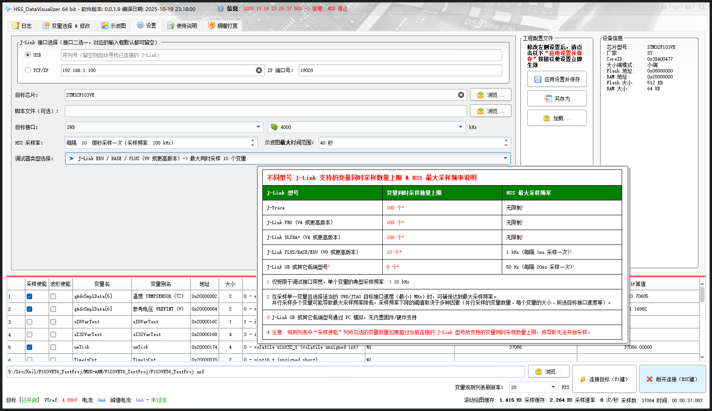

# :beers: HSS Data Visualizer

## :book: 简介

本仓库用于 HSS Data Visualizer 的发布，下载请跳转 [发布页面 (当前版本: v0.0.0.3)](https://github.com/DigitalAllianceStudio/HSS_DataVisualizer/releases)

本程序通过 SEGGER High-Speed-Sampling (HSS) 方式，对 MCU 上的 RAM、Flash、寄存器进行非侵入式的后台高速访问，并实时可视化显示到用户界面，其原理类似于 J-Scope、STM Studio、STM32CubeMonitor。

### :spiral_notepad: CSV 文件导出

> 将导出后的 `.csv` 文件通过 Excel 另存为 `.xlsx` 格式后，进行图表分析

## :gear: 环境

- Qt 5.15.2 MSVC 2019 (x86 or x64)

----------

:star: Copyright © 2023 Digital Alliance Studio. All rights reserved.
